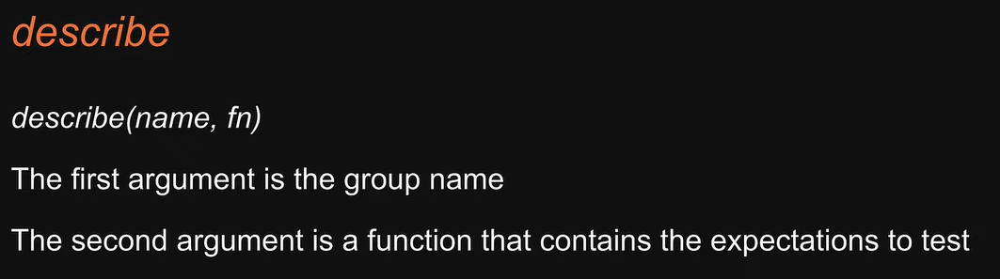

# JEST vs REACT Testing Library

# Types of Tests

Testing pyramid states that number of unit tests are more than integration tests and then comes the E2E tests.  

Here we are mostly writing unit tests and E2E tests. 

# Installation of JEST and RTL in create-react-app
1. react testing library is already present in it.
2. you have react scripts library installed which installs JEST automatically.
3. for running the tests use "npm test command" . look at package.json

# Test Driven Developement (TTD)

# JEST watch Mode

1. type 'w' to enable watch mode and 'a' to run all tests.

# JEST Filtering the tests
1. you can run all the test all the tests by 'a'.
2. you can run a test by it's filename.
3. you can run a test by it's name.
4. if you want to run only one test ina file then write :- test.only().
    If you want to skip the test write :- test.skip().

# Grouping Tests with JEST

1. you can use the describe method to group the tests. as it is a Jest method therefore it is global . no need to import. 
2. you can use skip and only methods with describe as well.
3. you can write 2 or more describe blocks in a single file as well.
4. describe nesting is allowed. that means you can write another describe block in another describe block.
5. The Test suite is the number of test files and not the number of decribe blocks.

# JEST filename conventions

1. all this filenames are allowed . JEST will automatically pick it and run it .

# Then Replacement
1. in place of test() method you can use it() method.
2. to write test.only() use fit() method.
3. to write test.skip() use xit() method.
4. sometimes the code is written in this way . so do not confuse.
